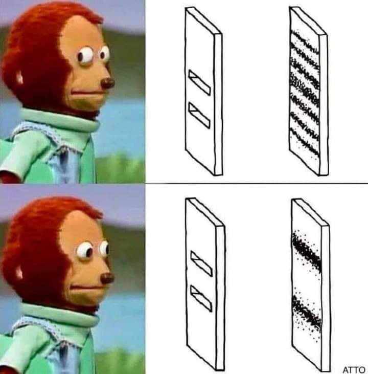

# FDM - Pràctica 6

Script en python per modelar un oscil·lador quantic. Les equacions d'ona estan incrustades en el codi, és menys doloros apdenre on són les equacions i modificarles que no haber-les de picar cada cop que executes el programa :)

